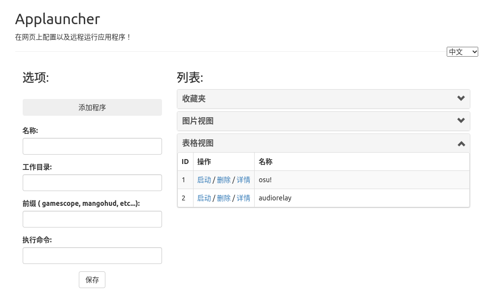

 # Weblauncher
  

非常简单的用flask写的程序启动器。 
可以安装成pwa应用然后用图形化界面添加-编辑-启动服务器上的程序。还可以在手机上用。 
我用来在自己的linux机器上整理启动游戏或者什么别的。

## Note
- 保存游戏配置
- 启动游戏
- 在手机或其他设备上启动本机游戏
- 多语言界面
- 封面显示游戏
- 拖拽文件或链接上传封面和图标
- 表格显示游戏
- 打开数据文件夹
- 通知游戏启动
- 显示icon和cover
- 全屏封面视图
### TODO
- 收藏夹功能
- 看游戏成就
- 弹游戏成就
- 增加点击按钮上传图标封面功能
- 增加跨平台环境变量