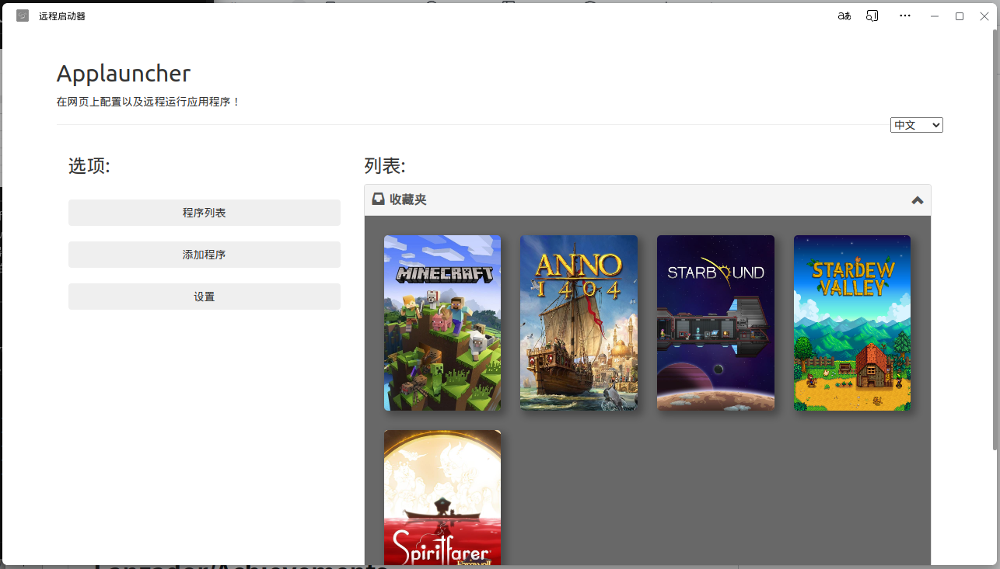

# Remotelauncher
> [English](README.md) [中文](README_CN.md)

 

非常简单的用flask写的程序启动器。 
可以安装成pwa应用然后用图形化界面添加-编辑-启动服务器上的程序。还可以在手机上用。 
我用来在自己的linux机器上整理启动游戏或者什么别的。

## Use
1. 安装 Python，用 `pip install -r requirements.txt` 安装 `requirements.txt` 里的依赖，运行 `entry.py` 启动
2. 下载 [Achievements](https://github.com/Lanzador/Achievements/releases) 然后放到项目目录下的 `__achievements__` 文件夹，按照 [Achievements](https://github.com/Lanzador/Achievements/releases) 的README进行配置。
## Note
- 保存游戏配置
- 启动游戏
- 在手机或其他设备上启动本机游戏
- 多语言界面
- 封面显示游戏
- 拖拽文件或链接上传封面和图标
- 表格显示游戏
- 打开数据文件夹
- 通知游戏启动
- 显示icon和cover
- 全屏封面视图
- 点击按钮上传图标封面功能
- 收藏夹功能（basic）
- 带着成就功能启动游戏 (by [Achievements](https://github.com/Lanzador/Achievements/releases))
#### TODO
- 增加跨平台环境变量

#### Credit
> `Lanzador` for [Achievements](https://github.com/Lanzador/Achievements/releases) \
> `Gowixx` for [unotify](https://github.com/Gowixx/unotify) \
> `syngency`, `dgoguerra` for [bootstrap-menu](https://github.com/syngency/bootstrap-menu)